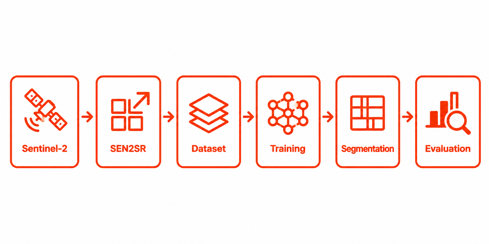
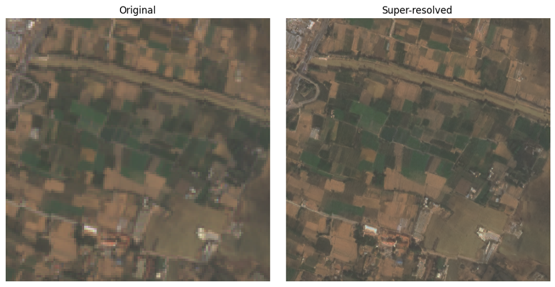

# SR4LC – Evaluation of Super-Resolution Techniques for Sentinel-2 Land Cover Classification


<p align="center">
  
</p>

Deep learning workflow developed to evaluate the impact of Sentinel-2 super-resolution on semantic land cover classification.

---

# Overview

This repository contains the scripts and documentation developed during my Master's Thesis:

**Evaluation of Super-Resolution Techniques for Sentinel-2 Land Cover Classification**

The work was carried out during an internship at **Planetek Italia** as part of the **SR4LC (Super-Resolution for Land Cover Classification)** project.

The objective of SR4LC is to assess whether deep learning-based super-resolution of Sentinel-2 imagery improves semantic land cover classification performance.

<p align="center">
  
</p>

*Comparison between the original Sentinel-2 image (10 m) and the SEN2SR super-resolved image (2.5 m).*

---

# Abstract

SR4LC investigates whether deep learning-based super-resolution can improve semantic land cover classification from Sentinel-2 imagery.

The proposed workflow combines image super-resolution using **SEN2SR**, semantic segmentation with **UNet**, and quantitative evaluation through confusion matrices and **Overall Accuracy (OA)**.

This repository documents the complete methodology developed during the project, from image preprocessing and super-resolution to semantic segmentation and model evaluation.

> **Note**
>
> Due to confidentiality restrictions, this repository only contains the scripts developed by the author.
>
> The core processing pipeline provided by **Planetek Italia** is proprietary and cannot be publicly distributed.
>
> To document the work carried out during the internship, the repository includes both the scripts used in the final workflow and earlier experimental versions developed throughout the project.

---

# Objectives

The main objectives of the project are:

- Generate super-resolved Sentinel-2 imagery using **SEN2SR**.
- Build semantic segmentation datasets from Sentinel-2 imagery and Coastal Zones reference data.
- Train a **UNet** semantic segmentation model.
- Perform large-image semantic segmentation inference.
- Evaluate the classification performance using confusion matrices and Overall Accuracy (OA).

---

# Study Area

The study focuses on coastal regions of Italy using:

- Sentinel-2 imagery
- Coastal Zones Land Cover / Land Use 2018 reference dataset

---

# Workflow

The workflow implemented during the project consists of the following stages:

1. Sentinel-2 data preparation
2. Image super-resolution using SEN2SR
3. Dataset generation
4. Dataset optimization with LitData
5. UNet training
6. Large-image inference
7. Classification evaluation

---

# Repository Organization

The repository is organized into two main folders.

## Final_workflow

Contains the scripts corresponding to the final methodology presented in the Master's Thesis.

It includes:

- Super-resolution
- Dataset generation
- Dataset optimization
- Model training
- Large-image inference
- Validation

---

## Old_workflow

Contains previous versions of the workflow, experimental implementations, and debugging scripts developed throughout the project.

Although these scripts are not part of the final methodology, they document the evolution of the project and the different approaches explored during development.

---

# Repository Structure

```text
TFM_SR4LC/
│
├── README.md
├── LICENSE
├── CITATION.cff
│
├── Final_workflow/
│   ├── 1_SuperResolution/
│   ├── 2_Segmentation/
│   ├── 3_Validation/
│   ├── model/
│   └── requirements/
│
└── Old_workflow/
```

---

# Repository Contents

| Included | Not Included |
|----------|--------------|
| Python scripts | Sentinel-2 imagery |
| Workflow documentation | Training datasets |
| Configuration files | Pre-trained model weights (`*.safetensor`) |
| Validation scripts | Proprietary Planetek Italia code |

---

# Workflow Outputs

The workflow produces:

- Super-resolved Sentinel-2 imagery
- Semantic segmentation datasets
- Optimized datasets for Lightning AI
- Trained UNet models
- Georeferenced prediction maps
- Confusion matrices
- Overall Accuracy (OA)

---

# Technologies

### Programming

- Python

### Deep Learning

- PyTorch
- PyTorch Lightning
- Lightning AI
- LitData

### Geospatial

- GDAL
- Rasterio
- QGIS

### Earth Observation

- Sentinel-2
- SEN2SR

---

# Getting Started

The final workflow is organized into three main stages:

1. **Super-resolution** (`Final_workflow/1_SuperResolution`)
   - Generate super-resolved Sentinel-2 imagery using SEN2SR.

2. **Semantic Segmentation** (`Final_workflow/2_Segmentation`)
   - Prepare the dataset.
   - Optimize the data with LitData.
   - Train the UNet model.
   - Perform large-image inference.

3. **Validation** (`Final_workflow/3_Validation`)
   - Evaluate the classification results.
   - Generate validation metrics and supporting outputs.

---

# Citation

If you use this repository in your research, please cite it using the `CITATION.cff` file included in this repository.

GitHub automatically generates citation formats (APA, BibTeX, etc.) through the **"Cite this repository"** option.

---

# Author

**María Victoria León Parra**

Master's Thesis – University of Girona (UNIGIS Girona)

---

# Acknowledgements

This work was developed during an internship at **Planetek Italia** as part of the **SR4LC (Super-Resolution for Land Cover Classification)** project.

The author gratefully acknowledges the support of the GeoAI team and all the guidance provided throughout the internship.